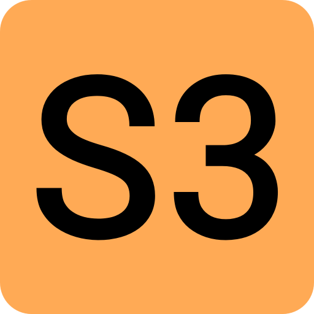

# Sand3
 Fast celullar automaton with fully customizable materials and rules.



## Features

- Material editor for creating up to 255 materials with custom color and rules.
- 5x5 neighborhood rules for complex behaviours and patterns.
- Smooth zoom and panning controls for easy navigation.
- Hardware-accelerated GPU simulation using Vulkan compute shaders for high performance.
- Optimized multithreaded and single-threaded simulation for best performance on any device.
- Multiplatform support (Windows, Linux).
- Step-by-step simulation for debugging rules.
- Helpful tooltips and shortcuts in the GUI.
- Standalone executable for easy portability.
- Compressed save files using a BWT + RLE compression algorithm.
- Inherit rules from other materials for easier material creation.
- Square and circle brushes with support for straight lines and flood fill.
- Simple undo/redo system to help creating complex saves.
- Fully customizable keyboard shortcuts and UI theme colors.

## Configuration

All keybinds, graphics settings, simulation backend, and UI theme colors are fully customizable.
See [CONFIG.md](CONFIG.md) for the complete reference of `config.ini` and `set_config.ini` settings and delta-only saving.

## Shortcuts


### Simulation
- **Space**: Toggle simulation
- **F**: Step simulation by one frame (when paused)
- **R**: Clear / Reset grid

### Camera
- **W / A / S / D**: Move camera (Hold Shift for fast pan)
- **Middle Mouse Drag**: Pan camera
- **Shift + Scroll / PageUp / PageDown / +/-**: Zoom camera

### General
- **1 - 9**: Quick select material (slots 1 to 9)
- **V**: Toggle compact UI
- **Ctrl + Z**: Undo last action
- **Ctrl + Y / Ctrl + Shift + Z**: Redo action
- **F11**: Toggle fullscreen
- **Escape**: Cancel selection/paste/move, or Quit

### Tools & Selection
- **B**: Switch to Brush tool
- **Left Mouse Drag (Select mode)**: Select box region
- **Left Mouse Drag (inside box)**: Move selected cells
- **Left Mouse Drag (handles)**: Resize selection (corners & midpoints)
- **Q**: Rotate selection 90° clockwise
- **E**: Rotate selection 90° counter-clockwise
- **Ctrl + C**: Copy selection
- **Ctrl + X**: Cut selected cells to clipboard
- **Ctrl + V**: Paste clipboard at cursor (Left click to stamp)
- **Ctrl + F**: Fill selected cells with selected material
- **Delete**: Delete selected cells
- **Arrow Keys (Shift for 10x)**: Nudge selected cells
- **Escape / Right Click**: Deselect / Cancel move or paste

### Grid
- **Left Mouse Drag**: Draw material
- **Right Mouse Drag**: Erase material
- **Shift + Mouse Drag**: Draw straight line or erase
- **Shift + Alt + Mouse Click**: Flood fill or erase
- **Middle Click**: Eyedropper (pick material)

### Brush
- **C**: Switch to Selection tool
- **T**: Next brush shape (Square, Circle)
- **Scroll Up/Down**: Adjust brush size
- **Ctrl + Scroll Up/Down**: Faster brush size adjust

### Rule Grid
- **Left Click**: Select material(s)
- **Shift + Left Click / Mouse Drag**: Paint material(s)
- **Middle Click**: Copy material(s)
- **Right Click**: Clear cell(s)

## Building

### Prerequisites

Install a C++20 compatible compiler (GCC recommended) and CMake.

Make sure to update all submodules:

```bash
git submodule update --init --recursive
```

## Using CMake

### Linux Building

#### Native compilation using GCC

To build as a Release (default):

```bash
cmake -B build --preset linux-gcc
cmake --build build
```

#### Windows cross-compilation using MinGW-w64

```bash
cmake -B build --preset windows-mingw
cmake --build build
```

### Windows Building

#### Native compilation using MSYS2 MinGW-w64

```bash
cmake -B build --preset windows-mingw
cmake --build build
```

## Running

### Linux

Run it from the "./bin/linux" folder.

```bash
cd ./bin/linux
./sand3
```

### Windows

Just run it from the "./bin/win64" folder.

```powershell
cd .\bin\w64
.\sand3.exe
```

## Dependencies

All dependencies are included as a submodule in the "third-party/" directory.

- [fmt](https://github.com/fmtlib/fmt) - Fast formatting library.
- [nlohmann_json](https://github.com/nlohmann/json) - Modern JSON for C++.
- [SDL3](https://github.com/libsdl-org/SDL) - Simple DirectMedia Layer.
- [imgui](https://github.com/ocornut/imgui) - Dear ImGui.
- [volk](https://github.com/zeux/volk) - Meta-loader for Vulkan API.
- [Vulkan-Headers](https://github.com/KhronosGroup/Vulkan-Headers) - Vulkan API header files.