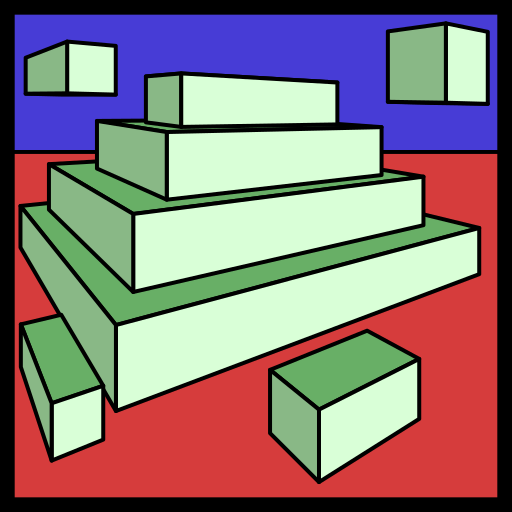

# Sand3
 Fast celullar automaton with fully customizable materials and rules.



## Features

- Material editor for creating up to 255 materials with custom color and rules.
- 5x5 neighborhood rules for complex behaviours and patterns.
- Smooth zoom and panning controls for easy navigation.
- Optimized multithreaded and single-threaded simulation for best performance on any device.
- Multiplatform support (Windows, Linux).
- Step-by-step simulation for debugging rules.

## Building

Use CMake for building the project.

To build as a Release (default):

```bash
cmake -B build -DCMAKE_BUILD_TYPE=Release
cmake --build build
```

To build as a Debug (performance may be significantly worse):

```bash
cmake -B build -DCMAKE_BUILD_TYPE=Debug
cmake --build build
```

## Running

Just run it from the "./bin" folder.

```bash
cd ./bin
./Sand3
```

## Dependencies

All dependencies are included as a submodule in the "third-party/" directory.

- [SDL3](https://github.com/libsdl-org/SDL)
- [ImGui](https://github.com/ocornut/imgui)